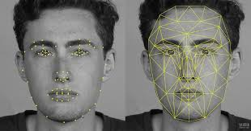
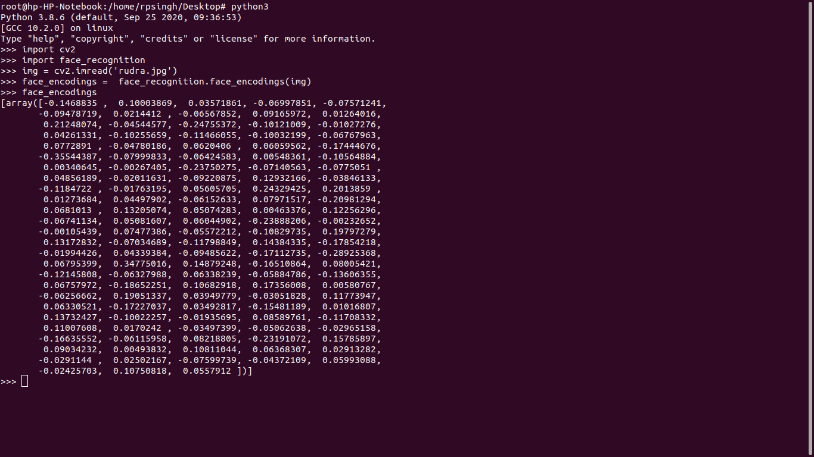

# Digital-Attendance-System

Employees are the key parameters for any organization. If they work efficiently, then only organizational growth can be expected. Their daily track is that is why needed to observe if employees are working regularly or not; how much time they spent on break and how much on performing assigned tasks. The module here is developed with the intense of described motives. It has following features:  
        -> It matches clicked photo on daily bases with the registered one of relevant employee.  
        -> The GeoLocation of employee is automatically checked and then proceed for the next if he/she is in allowed campus locations(using Latitude and Longitude).  
        -> Checking image with the databse of employee.  
        -> if get matched mark the Attendance of the perticular,  

Face Recognition : It is the technique of identifying or verifying the identity of the person using his/her face. It captures, analyzes, and compares patterns based                    on the person's facial details. like ratio of ditance between ear to distance between eyes etc.  

After calculating it generates a feature vector whose we call face encodings. It will help us to identify the person.  

